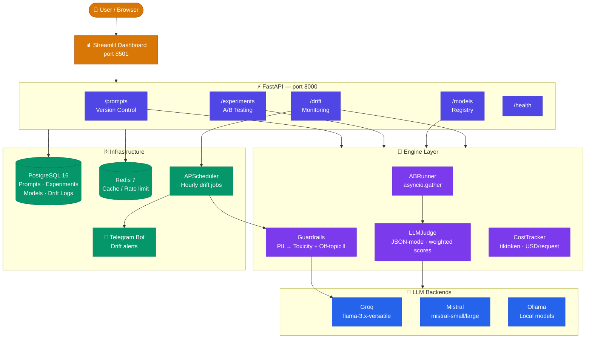

<div align="center">


<br/>

<!-- Tech stack badges -->
[](https://python.org)
[](https://fastapi.tiangolo.com)
[](https://postgresql.org)
[](https://sqlalchemy.org)
[](https://streamlit.io)
[](https://docker.com)

<br/>

<!-- Quality badges -->
[](#running-tests)
[](#running-tests)
[](https://github.com/astral-sh/ruff)
[](https://github.com/0DevDutt0/NeuralOps/actions)
[](LICENSE)
[](https://github.com/0DevDutt0)

<br/><br/>

> **NeuralOps treats prompts like code — versioned, A/B tested with statistical rigour, monitored for quality drift, and protected by multi-layer guardrails.**
> Built solo from the ground up: FastAPI · async SQLAlchemy 2.0 · Groq · Presidio · APScheduler · Streamlit.

<br/>

[⚡ Quick Start](#quick-start) · [✨ Features](#features) · [🏗 Architecture](#architecture) · [💻 Code Highlights](#code-highlights) · [🔌 API Reference](#api-reference) · [📊 Dashboard](#dashboard) · [🧪 Tests](#running-tests) · [🗂 Structure](#project-structure)

</div>

---

## At a Glance

<div align="center">

<table>
  <tr>
    <td align="center" width="160">
      <br/>
      <b>Tests Written</b><br/>
      <sub>unit + integration</sub>
    </td>
    <td align="center" width="160">
      <br/>
      <b>Test Coverage</b><br/>
      <sub>pytest-cov</sub>
    </td>
    <td align="center" width="160">
      <br/>
      <b>Guardrail Layers</b><br/>
      <sub>PII · toxicity · off-topic</sub>
    </td>
    <td align="center" width="160">
      <br/>
      <b>LLM Providers</b><br/>
      <sub>Groq · Mistral · Ollama</sub>
    </td>
    <td align="center" width="160">
      <br/>
      <b>Dashboard Pages</b><br/>
      <sub>Streamlit + Plotly</sub>
    </td>
    <td align="center" width="160">
      <br/>
      <b>Ruff Errors</b><br/>
      <sub>E · F · I · UP rules</sub>
    </td>
  </tr>
</table>

</div>

---

## The Problem NeuralOps Solves

Most production LLM apps share four fatal flaws. NeuralOps eliminates all of them.

<div align="center">

| ❌ Without NeuralOps | ✅ With NeuralOps |
|---|---|
| Prompts live in `.env` files — no history, no rollback | Semver versioning · unified diff · one-click rollback |
| "Which prompt is better?" decided by gut feeling | Concurrent A/B trials scored by `llama-3.3-70b` as judge |
| Silent quality degradation — teams find out via user complaints | Hourly drift checks · auto Telegram alert when score < threshold |
| PII leaks, toxic outputs, off-topic responses in prod | Presidio PII · toxic-bert · LLM relevance classifier — all in parallel |

</div>

---

## Features

<div align="center">

| | Feature | What it does |
|:---:|---|---|
| 🔀 | **Prompt Version Control** | Semver versioning, unified diff, activate, rollback — git for prompts |
| 🧪 | **A/B Experiment Engine** | Two prompt versions run concurrently via `asyncio.gather`; every trial scored |
| ⚖️ | **LLM-as-Judge** | `llama-3.3-70b-versatile` in JSON mode scores [relevance · accuracy · clarity · safety] |
| 📊 | **Welch's t-test Significance** | Auto-promotes winner at p < 0.05 after ≥ 30 trials — real statistics, not vibes |
| 🛡️ | **PII Detection** | Microsoft Presidio + spaCy `en_core_web_lg` — emails, SSNs, credit cards, phone numbers |
| ☣️ | **Toxicity Scoring** | `unitary/toxic-bert` via HuggingFace — async, CPU/CUDA, configurable threshold |
| 🎯 | **Off-Topic Detection** | Groq LLM classifier with keyword-overlap fallback — blocks irrelevant outputs |
| 📉 | **Quality Drift Monitoring** | APScheduler runs synthetic tests hourly; fires Telegram alert on regression |
| 🤖 | **Model Registry** | Register any LLM, set routing priority, track USD cost per 1k tokens |
| 💰 | **Cost Tracking** | Per-request cost estimation (tiktoken) for Groq and Mistral; aggregate reports |
| 🌐 | **Multi-Backend LLM Client** | Groq · Mistral · Ollama — unified interface with tenacity retry + automatic fallback |
| 📈 | **6-Page Streamlit Dashboard** | Overview · Prompts · Experiments · Models · Drift · Cost — with Plotly charts |
| 🐳 | **One-Command Docker Stack** | `docker-compose up --build` → PostgreSQL + Redis + API + Dashboard, fully wired |
| 🔁 | **GitHub Actions CI/CD** | ruff + mypy + pytest matrix (Python 3.11 & 3.12) on every push |

</div>

---

## Architecture



### Trial Execution Flow

```
POST /api/v1/experiments/{id}/trials/  { "user_input": "..." }
  │
  ├─① asyncio.gather(                       ← both LLM calls in parallel
  │       LLMClient.complete(version_a),
  │       LLMClient.complete(version_b)
  │   )  ──────────────────────────────────→ ~400ms total (not ~800ms serial)
  │
  ├─② asyncio.gather(                       ← both judge calls in parallel
  │       LLMJudge.score(output_a),
  │       LLMJudge.score(output_b)
  │   )  ──────────────────────────────────→ Groq llama-3.3-70b · JSON mode
  │       scores: {relevance, accuracy, clarity, safety, composite}
  │
  ├─③ INSERT ExperimentTrial → PostgreSQL   ← latency_ms, score, output stored
  ├─④ UPDATE Experiment.mean_score_a/b      ← running mean maintained
  └─⑤ IF trial_count ≥ 30:
          Welch's t-test → p-value          ← scipy.stats.ttest_ind(equal_var=False)
          IF p < 0.05: mark winner, status = "completed"

Response: { output_a, output_b, score_a, score_b, winner_this_trial, latency_ms_a/b }
```

---

## Code Highlights

> These snippets show the design decisions that matter — not boilerplate.

### 1 — Concurrent A/B Trial (the core engine)

```python
# neuralops/engine/ab_runner.py
# Two LLMs fire simultaneously. Two judge calls score simultaneously.
# Sequential would be 2× slower — asyncio.gather eliminates the wait.

resp_a, resp_b = await asyncio.gather(call_a(), call_b())

score_a, score_b = await self._judge.score_pair(
    response_a=resp_a.content,
    response_b=resp_b.content,
    user_input=user_input,
)

# Auto-promote winner when n ≥ 30 with p < 0.05
if experiment.trial_count >= 30:
    sig = _run_significance_test(scores_a, scores_b, settings.experiment_significance_level)
    if sig.is_significant:
        experiment.winner = sig.winner
        experiment.status = "completed"
```

### 2 — Guardrail Pipeline (PII blocks first; toxicity + off-topic run in parallel)

```python
# neuralops/services/guardrail_service.py
# PII is a hard blocker — checked first.
# Toxicity and off-topic never touch real model inference on the event loop;
# CPU-bound work is offloaded via run_in_executor.

pii = await detect_pii(text)
if pii.has_pii:
    return GuardrailResult(passed=False, blocked_by="pii", ...)

toxicity, off_topic = await asyncio.gather(
    score_toxicity(text),
    detect_off_topic(text, system_context),
)
```

### 3 — LLM Client with Retry + Automatic Fallback

```python
# neuralops/services/llm_client.py
# Tenacity retries on rate limits with exponential backoff.
# complete_with_fallback() transparently switches provider on failure.

@retry(
    retry=retry_if_exception_type((LLMRateLimitError, LLMTimeoutError)),
    wait=wait_exponential(multiplier=1, min=1, max=10),
    stop=stop_after_attempt(3),
    reraise=True,
)
async def complete(self, prompt: str, backend: LLMBackend, ...) -> LLMResponse:
    match backend:
        case LLMBackend.GROQ:    return await self._complete_groq(...)
        case LLMBackend.MISTRAL: return await self._complete_mistral(...)
        case LLMBackend.OLLAMA:  return await self._complete_ollama(...)
```

### 4 — LLM-as-Judge (structured evaluation via JSON mode)

```python
# neuralops/engine/judge.py
# llama-3.3-70b scores every output on 4 weighted criteria.
# JSON mode guarantees parseable output — no regex hacks.

_WEIGHTS = {"relevance": 0.30, "accuracy": 0.30, "clarity": 0.20, "safety": 0.20}

response = await self._client.complete(
    prompt=_JUDGE_USER_TEMPLATE.format(user_input=..., response=...),
    system=_JUDGE_SYSTEM,
    model="llama-3.3-70b-versatile",
    response_format={"type": "json_object"},  # guaranteed JSON
    temperature=0.0,                           # deterministic scoring
)
# → {"relevance": 8.5, "accuracy": 7.0, "clarity": 9.0, "safety": 10.0,
#    "composite": 8.5, "reasoning": "...", "confidence": 0.9}
```

### 5 — SQLAlchemy 2.0 Async ORM (modern Mapped[] style)

```python
# neuralops/models/experiment.py
class Experiment(Base):
    __tablename__ = "experiments"

    id:           Mapped[str]           = mapped_column(String(36), primary_key=True)
    prompt_id:    Mapped[str]           = mapped_column(String(36), ForeignKey("prompts.id"))
    version_a:    Mapped[str]           = mapped_column(String(20))
    version_b:    Mapped[str]           = mapped_column(String(20))
    status:       Mapped[str]           = mapped_column(String(20), default="running")
    winner:       Mapped[str | None]    = mapped_column(String(1), nullable=True)
    trial_count:  Mapped[int]           = mapped_column(default=0)
    mean_score_a: Mapped[float | None]  = mapped_column(Float, nullable=True)
    mean_score_b: Mapped[float | None]  = mapped_column(Float, nullable=True)
    judge_criteria: Mapped[list]        = mapped_column(JSON, default=list)
```

---

## Tech Stack

<div align="center">


<br/>


</div>

<br/>

<div align="center">

| Layer | Technology | Detail |
|---|---|---|
| **API** | FastAPI 0.115 + Uvicorn | Lifespan context manager, Pydantic v2 validation, slowapi rate limiting |
| **ORM** | SQLAlchemy 2.0 async | `asyncpg` (prod), `aiosqlite` (dev/test), `Mapped[]` annotations |
| **Migrations** | Alembic | `async_engine_from_config`, URL injected from Pydantic Settings |
| **Config** | Pydantic Settings v2 | `@lru_cache` singleton, `async_database_url` property, env/`.env` |
| **LLM — Groq** | OpenAI SDK (base_url override) | `llama-3.3-70b-versatile` judge; `llama-3.1-8b-instant` completions |
| **LLM — Mistral** | mistralai SDK | `chat.complete_async`, lazy client init, `SystemMessage`/`UserMessage` |
| **LLM — Ollama** | httpx | `POST /api/chat`, local models, zero cost |
| **Retry** | Tenacity | `wait_exponential`, `retry_if_exception_type((RateLimitError, TimeoutError))` |
| **PII** | Microsoft Presidio | `AnalyzerEngine` + `AnonymizerEngine`, runs in `run_in_executor` |
| **Toxicity** | `unitary/toxic-bert` | HuggingFace `pipeline("text-classification")`, async executor offload |
| **Scheduling** | APScheduler 3.x | `AsyncIOScheduler`, started inside FastAPI lifespan |
| **Alerting** | python-telegram-bot 21 | Async `Bot.send_message`, lazy init, drift threshold alert |
| **Statistics** | scipy | `stats.ttest_ind(equal_var=False)` — Welch's t-test |
| **Token counting** | tiktoken | `encoding_for_model`, cost estimation across all providers |
| **Dashboard** | Streamlit + Plotly | `@st.cache_data(ttl=60)`, dark theme, 6 pages |
| **Logging** | structlog + rich | JSON renderer (prod), ConsoleRenderer (dev), contextvar propagation |
| **Testing** | pytest-asyncio + respx | `asyncio_mode="auto"`, transport-level mocking, in-memory SQLite |
| **Linting** | ruff + mypy | `E, F, I, UP` rules — 0 errors across entire codebase |
| **CI/CD** | GitHub Actions | Python 3.11 + 3.12 matrix, Codecov upload, Docker build on release |

</div>

---

## Quick Start

### Local (SQLite — zero config, works offline)

```bash
# Clone and enter
git clone https://github.com/0DevDutt0/NeuralOps.git && cd NeuralOps

# Virtual environment
python -m venv venv && source venv/bin/activate   # Windows: venv\Scripts\activate

# Install all dependencies
pip install -e ".[dev]"

# spaCy model for PII detection
python -m spacy download en_core_web_lg

# Configure (only GROQ_API_KEY is required)
cp .env.example .env && nano .env

# Migrate database
alembic upgrade head

# Launch API
python main.py
#  ✓  API:      http://localhost:8000
#  ✓  Swagger:  http://localhost:8000/docs

# Launch dashboard (new terminal)
streamlit run dashboard/app.py
#  ✓  Dashboard: http://localhost:8501
```

### Docker (PostgreSQL + Redis — production-equivalent)

```bash
git clone https://github.com/0DevDutt0/NeuralOps.git && cd NeuralOps
cp .env.example .env   # add GROQ_API_KEY

docker-compose up --build
#  ✓  API:       http://localhost:8000/docs
#  ✓  Dashboard: http://localhost:8501

# Optional: pgAdmin browser (dev profile)
docker-compose --profile dev up
#  ✓  pgAdmin:   http://localhost:5050  (admin@neuralops.local / admin)
```

---

## API Reference

### Create a Prompt + Version + Run an A/B Experiment

```bash
# 1. Create a prompt
PROMPT=$(curl -s -X POST http://localhost:8000/api/v1/prompts/ \
  -H "Content-Type: application/json" \
  -d '{"name": "support-agent", "description": "Customer support bot"}')

ID=$(echo $PROMPT | python -c "import sys,json; print(json.load(sys.stdin)['id'])")

# 2. Add two competing versions
curl -s -X POST http://localhost:8000/api/v1/prompts/$ID/versions/ \
  -H "Content-Type: application/json" \
  -d '{"version":"1.0.0","content":"Answer the following helpfully: {input}"}'

curl -s -X POST http://localhost:8000/api/v1/prompts/$ID/versions/ \
  -H "Content-Type: application/json" \
  -d '{"version":"2.0.0","content":"You are an expert support agent. {input} Be concise."}'

# 3. Create an A/B experiment
EXP=$(curl -s -X POST http://localhost:8000/api/v1/experiments/ \
  -H "Content-Type: application/json" \
  -d "{\"name\":\"concise-vs-verbose\",\"prompt_id\":\"$ID\",\"version_a\":\"1.0.0\",\"version_b\":\"2.0.0\"}")

EXP_ID=$(echo $EXP | python -c "import sys,json; print(json.load(sys.stdin)['id'])")

# 4. Run a trial
curl -s -X POST http://localhost:8000/api/v1/experiments/$EXP_ID/trials/ \
  -H "Content-Type: application/json" \
  -d '{"user_input": "How do I reset my password?"}'
```

**Trial response:**
```json
{
  "id": "...",
  "output_a": "To reset your password, visit the login page and click 'Forgot password'...",
  "output_b": "Click 'Forgot password' on the login page. Check your email for the reset link.",
  "score_a": 7.85,
  "score_b": 8.62,
  "winner_this_trial": "B",
  "latency_a_ms": 412,
  "latency_b_ms": 389
}
```

**Significance response (after 30+ trials):**
```json
{
  "trial_count": 35,
  "mean_score_a": 7.74,
  "mean_score_b": 8.51,
  "p_value": 0.0018,
  "is_significant": true,
  "winner": "B",
  "confidence_level": 0.95
}
```

<details>
<summary><b>📋 Full API endpoint reference</b></summary>

### Prompts
| Method | Endpoint | Description |
|---|---|---|
| `POST` | `/api/v1/prompts/` | Create prompt |
| `GET` | `/api/v1/prompts/` | List all prompts |
| `GET` | `/api/v1/prompts/{id}` | Get prompt by ID |
| `POST` | `/api/v1/prompts/{id}/versions/` | Add a version |
| `GET` | `/api/v1/prompts/{id}/versions/` | List versions |
| `POST` | `/api/v1/prompts/{id}/activate/{version}` | Activate version |
| `GET` | `/api/v1/prompts/{id}/diff/{v1}/{v2}` | Unified diff between versions |
| `POST` | `/api/v1/prompts/{id}/rollback/{version}` | Rollback to version |

### Experiments
| Method | Endpoint | Description |
|---|---|---|
| `POST` | `/api/v1/experiments/` | Create experiment |
| `GET` | `/api/v1/experiments/` | List experiments |
| `GET` | `/api/v1/experiments/{id}` | Get with recent trials |
| `POST` | `/api/v1/experiments/{id}/trials/` | Run a trial |
| `GET` | `/api/v1/experiments/{id}/significance` | Welch's t-test result |

### Models
| Method | Endpoint | Description |
|---|---|---|
| `POST` | `/api/v1/models/` | Register model |
| `GET` | `/api/v1/models/` | List models |
| `GET` | `/api/v1/models/{id}` | Get model |
| `PATCH` | `/api/v1/models/{id}` | Update |
| `DELETE` | `/api/v1/models/{id}` | Delete |
| `GET` | `/api/v1/models/routing/best` | Get highest-priority active model |

### Drift
| Method | Endpoint | Description |
|---|---|---|
| `GET` | `/api/v1/drift/summary` | Aggregate health across all prompts |
| `GET` | `/api/v1/drift/status/{prompt_id}` | Per-prompt drift status + score history |
| `GET` | `/api/v1/drift/logs` | Recent drift log entries |
| `POST` | `/api/v1/drift/trigger` | Manually trigger drift check |

</details>

---

## Dashboard

<div align="center">

```
┌─────────────────────────────────────────────────────────────────┐
│  NeuralOps Dashboard                               🟢 Connected │
├─────────────────────────────────────────────────────────────────┤
│  📊 Overview  │  Prompts  │  Experiments  │  Models  │  Drift  │  Cost
├─────────────────────────────────────────────────────────────────┤
│                                                                  │
│   ┌──────────┐  ┌──────────┐  ┌──────────┐  ┌──────────┐      │
│   │    12    │  │    4     │  │    2     │  │  $0.043  │      │
│   │ Prompts  │  │  Running │  │  Alerts  │  │ 24h Cost │      │
│   └──────────┘  └──────────┘  └──────────┘  └──────────┘      │
│                                                                  │
│   Score Timeline ──────────────────────────────────── [Plotly]  │
│   9.0 ┤                                          ╭──            │
│   8.0 ┤             ╭──────╮                ╭───╯              │
│   7.0 ┤ ╭──────╮   ╯      ╰───────╮    ╭──╯                   │
│   6.5 ┤─────────────────────────── ─────── ── Alert Threshold  │
│   6.0 ┤                             ╰───╯                      │
│       └─────────────────────────────────────────────────────   │
│         Mon      Tue      Wed      Thu      Fri      Sat        │
└─────────────────────────────────────────────────────────────────┘
```

</div>

| Page | What you see |
|---|---|
| **Overview** | KPI cards · active prompts · running experiments · 24h drift alerts · total cost |
| **Prompt Manager** | Create prompts · version timeline · inline unified diff viewer · activation toggle |
| **Experiments** | Create A/B test · live trial runner · score cards · significance gauge + p-value |
| **Model Registry** | Register models · cost-per-model bar chart · routing priority table |
| **Drift Monitor** | Per-prompt quality timeline · alert threshold line · alert history · manual trigger |
| **Cost Tracker** | Token usage over time · cost by model · daily/weekly aggregate breakdown |

---

## Running Tests

No API keys or external services required — all LLM calls are mocked at the `httpx` transport layer via `respx`.

```bash
# Full suite with coverage
pytest tests/ --cov=neuralops --cov-report=term-missing -v

# Unit tests only (< 5 seconds)
pytest tests/unit/ -v

# Integration tests only (full HTTP round-trips via ASGITransport)
pytest tests/integration/ -v

# Run a single module
pytest tests/unit/test_judge.py -v
```

```
========================= 142 passed in 12s =========================

Coverage:
  neuralops/engine/cost_tracker.py       ████████████████ 100%
  neuralops/models/                      ████████████████ 100%
  neuralops/schemas/                     ████████████████ 100%
  neuralops/core/exceptions.py           ████████████████ 100%
  neuralops/engine/judge.py              ███████████████░  96%
  neuralops/services/experiment_service  ███████████████░  99%
  neuralops/services/model_service.py    ████████████████ 100%
  neuralops/services/prompt_service.py   ██████████████░   90%
  TOTAL                                  █████████████░    81%
```

<details>
<summary><b>📋 Test file inventory (12 modules · 142 tests)</b></summary>

```
tests/
├── conftest.py                 Shared fixtures: in-memory SQLite · ASGITransport client · respx Groq mock
│
├── unit/
│   ├── test_ab_runner.py       Significance tests · Welch t-test · single trial end-to-end
│   ├── test_cost_tracker.py    calculate_cost · summarize_costs · model/provider breakdown (100%)
│   ├── test_drift_service.py   get_drift_status · get_drift_summary · real DriftLog rows
│   ├── test_experiment_service Full service paths: create · list · get · run_trial · significance
│   ├── test_guardrails.py      PII/toxicity/off-topic with monkeypatching + data structures
│   ├── test_judge.py           LLMJudge scoring · composite weights · parse fallback on bad JSON
│   ├── test_llm_client.py      Groq/Ollama via respx · Mistral lazy init · cost/token calc · close
│   ├── test_logging.py         configure_logging (JSON + dev modes) · noisy logger silencing
│   ├── test_model_service.py   Full CRUD · duplicate guard · active-only filter · routing (100%)
│   └── test_prompt_service.py  Version control · semver validation · diff · rollback · error paths
│
└── integration/
    ├── test_prompt_api.py      Prompt CRUD + versioning via full HTTP (ASGITransport → FastAPI)
    ├── test_experiment_api.py  Create → trial (mocked LLM) → significance → 404 guards
    └── test_model_api.py       Register · list · get · update · delete · 409 duplicate
```

</details>

---

## Project Structure

<details>
<summary><b>📁 Full annotated file tree (~75 files)</b></summary>

```
NeuralOps/
├── neuralops/                         Main Python package
│   ├── api/
│   │   ├── main.py                    FastAPI app factory · lifespan · scheduler startup
│   │   ├── dependencies.py            get_db() · get_ab_runner() injection
│   │   ├── middleware.py              CORS · request-ID · structured request logging
│   │   └── routers/
│   │       ├── prompts.py             8 endpoints: CRUD · versions · activate · diff · rollback
│   │       ├── experiments.py         5 endpoints: create · list · get · trial · significance
│   │       ├── models.py              6 endpoints: CRUD · routing/best
│   │       ├── drift.py               4 endpoints: summary · status · logs · trigger
│   │       └── health.py              /health · /ready
│   ├── core/
│   │   ├── config.py                  Pydantic Settings singleton · async_database_url property
│   │   ├── database.py                Async engine · session factory · get_db generator
│   │   ├── exceptions.py              Typed hierarchy → HTTP 4xx via to_http_exception()
│   │   └── logging.py                 structlog · JSON (prod) · ConsoleRenderer (dev)
│   ├── engine/
│   │   ├── ab_runner.py               Concurrent trial · running mean · Welch t-test trigger
│   │   ├── judge.py                   LLM-as-Judge · _WEIGHTS · _parse_judge_response
│   │   ├── cost_tracker.py            CostRecord · CostSummary · calculate_cost · summarize
│   │   └── guardrails/
│   │       ├── pii_detector.py        Presidio AnalyzerEngine · run_in_executor async wrapper
│   │       ├── toxicity_scorer.py     toxic-bert pipeline · async executor · label normalization
│   │       └── off_topic_detector.py  Groq classifier · _fallback_detect keyword overlap
│   ├── models/                        SQLAlchemy 2.0 Mapped[] ORM
│   │   ├── prompt.py                  Prompt + PromptVersion (semver, content, variables, meta)
│   │   ├── experiment.py              Experiment + ExperimentTrial (scores, latency, reasoning)
│   │   ├── model_registry.py          RegisteredModel (provider, cost, routing_priority)
│   │   └── drift_log.py               DriftLog (time-series quality snapshots + alert flag)
│   ├── schemas/                        Pydantic v2 request/response models
│   ├── services/
│   │   ├── llm_client.py              Unified client · match/case backends · retry decorator
│   │   ├── prompt_service.py          Version control CRUD · difflib.unified_diff · rollback
│   │   ├── experiment_service.py      Orchestrates ABRunner · loads versions · stores trial
│   │   ├── drift_service.py           run_drift_check · get_drift_status · get_drift_summary
│   │   ├── guardrail_service.py       Pipeline: PII → asyncio.gather(toxicity, off-topic)
│   │   └── model_service.py           Registry CRUD · get_best_model routing
│   └── migrations/alembic/
│       ├── env.py                     Async-compatible · URL from settings · imports all models
│       └── versions/001_initial.py    Creates 6 tables with FK indexes
├── dashboard/app.py                    6-page Streamlit · Plotly · @st.cache_data(ttl=60)
├── tests/                             142 tests (see above)
├── .github/workflows/
│   ├── ci.yml                         pytest + ruff + mypy · Python 3.11 + 3.12 matrix
│   └── docker.yml                     Docker build + push on release tag
├── Dockerfile                         Multi-stage builder→runtime · non-root user · HEALTHCHECK
├── docker-compose.yml                 postgres:16 · redis:7 · api · dashboard · pgadmin (dev)
├── pyproject.toml                     PEP 517 · all deps · ruff/mypy/pytest config
├── alembic.ini                        script_location · default SQLite URL
├── main.py                            WindowsSelectorEventLoopPolicy · uvicorn.run
└── .env.example                       All 18 variables documented with defaults
```

</details>

---

## Configuration

<details>
<summary><b>⚙️ All environment variables</b></summary>

| Variable | Default | Description |
|---|---|---|
| `GROQ_API_KEY` | — | **Required.** Groq API key |
| `MISTRAL_API_KEY` | — | Optional — enables Mistral backend |
| `OLLAMA_BASE_URL` | `http://localhost:11434` | Local Ollama server |
| `LLM_PROVIDER` | `groq` | Default backend: `groq` · `mistral` · `ollama` |
| `DATABASE_URL` | `sqlite+aiosqlite:///./neuralops_dev.db` | PostgreSQL or SQLite |
| `NEURALOPS_PORT` | `8000` | API server port |
| `NEURALOPS_ENVIRONMENT` | `development` | `development` · `production` · `test` |
| `JUDGE_MODEL` | `llama-3.3-70b-versatile` | Model used for scoring |
| `EXPERIMENT_SIGNIFICANCE_LEVEL` | `0.05` | p-value threshold for declaring a winner |
| `DRIFT_ALERT_THRESHOLD` | `6.5` | Composite score below this fires an alert |
| `DRIFT_CHECK_INTERVAL_MINUTES` | `60` | APScheduler cadence |
| `TOXICITY_THRESHOLD` | `0.7` | toxic-bert probability threshold |
| `TOXICITY_DEVICE` | `cpu` | `cpu` or `cuda` |
| `PII_ENABLED` | `true` | Enable/disable Presidio scanning |
| `TELEGRAM_BOT_TOKEN` | — | Optional — for drift alerts |
| `TELEGRAM_CHAT_ID` | — | Optional — for drift alerts |
| `DASHBOARD_API_URL` | `http://localhost:8000` | API URL for Streamlit |
| `SECRET_KEY` | — | Token signing key |

</details>

---

## Why This Project Is Hard to Build

<div align="center">

| Challenge | What made it non-trivial | How it's solved here |
|---|---|---|
| **Async Python on Windows** | `asyncpg` + ProactorEventLoop crashes | `WindowsSelectorEventLoopPolicy` set before uvicorn import |
| **CPU ML on async event loop** | Presidio + toxic-bert block the event loop | Both wrapped in `loop.run_in_executor(None, ...)` |
| **SQLite in async tests** | `pool_size`/`max_overflow` crash SQLite | Pool kwargs only applied for PostgreSQL URLs |
| **APScheduler + FastAPI** | "Event loop already running" on Windows | Scheduler initialized inside FastAPI `lifespan`, not module level |
| **LLM mocking in tests** | OpenAI SDK wraps httpx — hard to intercept | `respx` mocks at transport level, `ASGITransport` for API tests |
| **JSON mode reliability** | LLM occasionally returns malformed JSON | `_parse_judge_response` gracefully falls back to default 5.0 scores |
| **Concurrent scoring fairness** | Sequential scoring biases latency | Both completions AND both judge calls use `asyncio.gather` |
| **Statistical rigour** | Most AB tests skip variance assumptions | Welch's t-test (`equal_var=False`) — correct for unequal group sizes |

</div>

---

## Contributing

1. Fork → create feature branch from `main`
2. `pip install -e ".[dev]"` → write tests first
3. Lint: `ruff check neuralops/ tests/ --fix` then `mypy neuralops/`
4. All 142 existing tests must still pass: `pytest tests/ -v`
5. Open a PR with a clear description — coverage must not drop below 80%

Bug reports and feature requests → [GitHub Issues](https://github.com/0DevDutt0/NeuralOps/issues)

---

## Roadmap

```
v0.1.0  ████████████████████  ✅  Complete — full platform released
v0.2.0  ░░░░░░░░░░░░░░░░░░░░  🔜  Streaming API · Slack/Discord webhooks
v0.3.0  ░░░░░░░░░░░░░░░░░░░░  📋  Evaluation datasets · batch scoring
v0.4.0  ░░░░░░░░░░░░░░░░░░░░  📋  Jinja2 prompt templates · variable validation
v1.0.0  ░░░░░░░░░░░░░░░░░░░░  🎯  Multi-tenant · OpenTelemetry tracing
```

---

## License

MIT © 2025 [Devdutt S](https://github.com/0DevDutt0)

---

<div align="center">

<sub>Built with Python 3.13 · FastAPI · SQLAlchemy · Groq · Presidio · APScheduler · Streamlit</sub>

<br/>

**If NeuralOps impressed you, a ⭐ star means a lot.**

</div>


